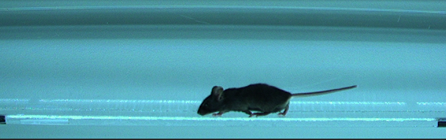
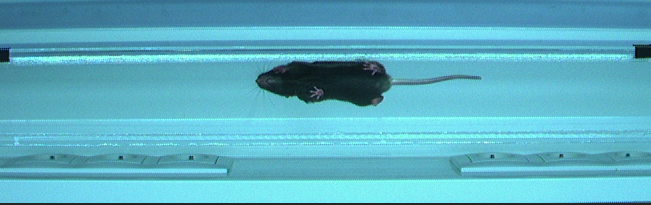
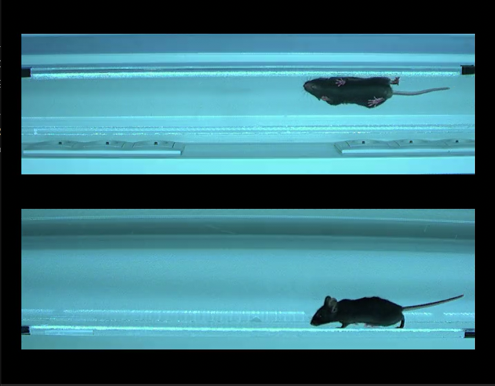

# BatchExperimentMerger

Small script that merges two videos of an experiment into one video.

Written for the Neural Circuitries and Motor Repair Laboratory in the University of Copenhagen.

## Requirements

- Python
- moviepy
- tqdm

## Instructions

**These instructions work for Windows. If on Linux or MacOS, change every `\` with a `/`.**

1. Open a terminal (Powershell, cmd, etc.) and type: 
   ```
   git clone https://github.com/SimpingOjou/BatchExperimentMerger.git
   cd .\BatchExperimentMerger
   pip install -r requirements.txt
   ```
    This will clone the repository on your pc and install the needed requirements to make the script work.
2. Modify the parameters on top of `main.py` as needed and run the python code by typing in the terminal:
    ```
    python .\main.py
    ```
    - It is also possible to run the code with any editor like VSCode, Spyder, etc.

## Figures

### First video for the example



### Second video for the example



### Result of the script

The borders, fps, speeds, and extensions of the new video can be changed at will by changing the parameters in `main.py`



# Credits

[Chang Hui Simone Lin](https://github.com/SimpingOjou)

[Walid Outtaleb](https://github.com/Nyllea)
